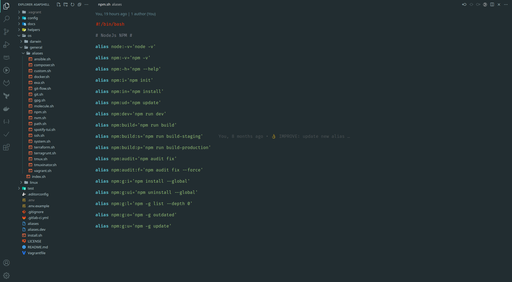
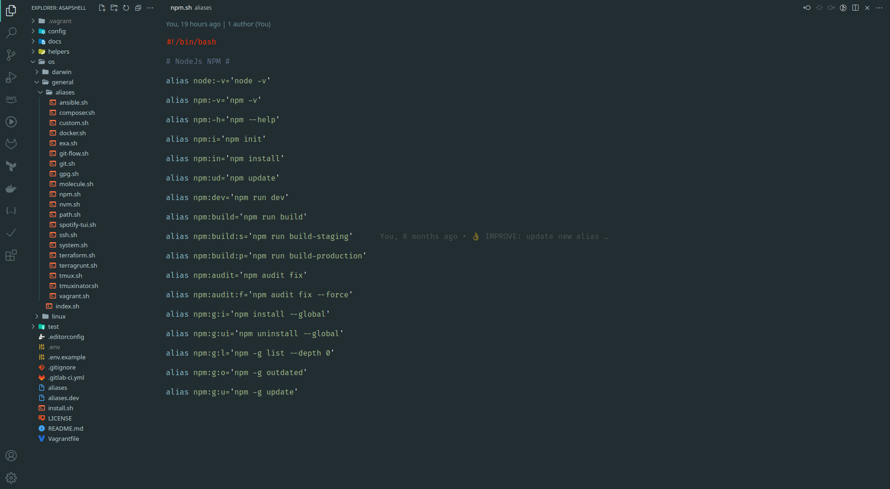
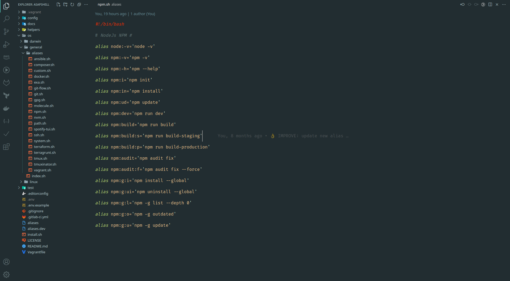
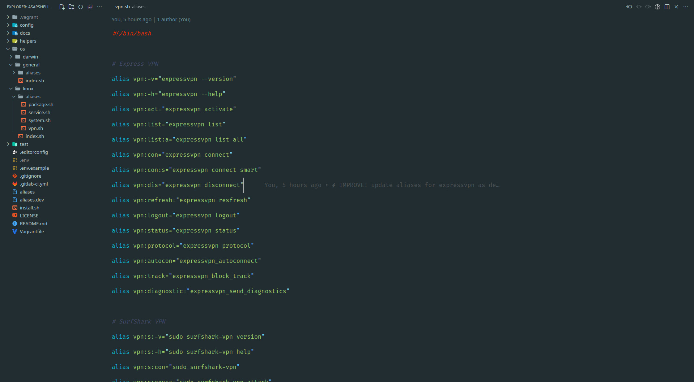
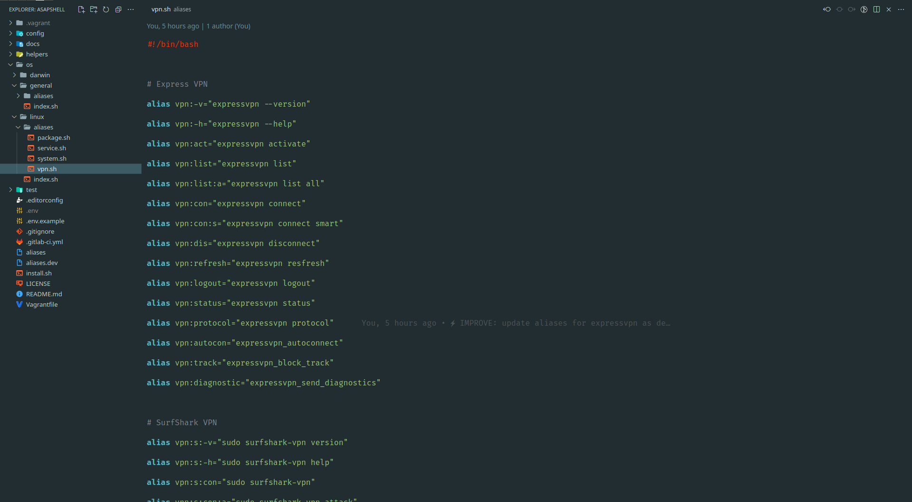

# Manjaro Dark Themes for (VSCode or VSCodium)

Color base from Manjaro Linux Color Palette (i3)

Inspired from:

-   OneDark Pro [link](https://marketplace.visualstudio.com/items?itemName=zhuangtongfa.Material-theme)
-   Nord [link](https://marketplace.visualstudio.com/items?itemName=arcticicestudio.nord-visual-studio-code)
-   Night Owl [link](https://marketplace.visualstudio.com/items?itemName=sdras.night-owl)
-   Tokyo Night [link](https://marketplace.visualstudio.com/items?itemName=enkia.tokyo-night)
-   Halcyon [link](https://marketplace.visualstudio.com/items?itemName=brittanychiang.halcyon-vscode)

## Color scheme base from

<h1 align="center">
   
    
    
  Manjaro Dark OneDark
   
   
</h1>

<h1 align="center">
   
    
    
  Manjaro Dark Nord
   
   
</h1>

<h1 align="center">
   
    
    
  Manjaro Dark Owl
   
   
</h1>

<h1 align="center">
   
    
    
  Manjaro Dark Tokyo
   
   
</h1>

<h1 align="center">
   
    
    
  Manjaro Dark Halcyon
   
   
</h1>

## License

MIT LICENSE

## Author Information

This code was created in 2023 by [Asapdotid](https://github.com/asapdotid).
